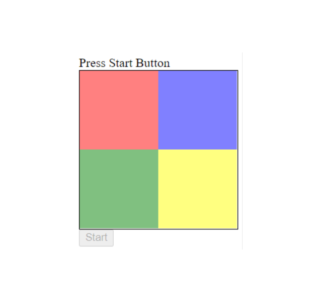

# Pattern-Matching-Game
Pattern matching game using JavaScript to setup game board grid. Watch a sequence of light up colors. Click the colors in the same sequence to progress.

# Features
- Math to create random sequence.
- setTimeout to light up element.
- Element style manipulation.

# Image

